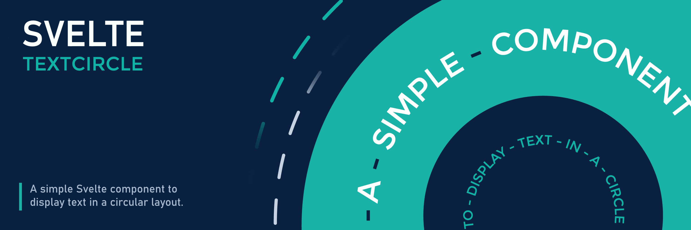

# svelte-textcircle

A Svelte component that displays text in a circular layout with customizable animations and styling.



### You can check out the [Demo](https://svelte.dev/playground/a0daad6ee5204737aae3511184c9e335?version=5.28.2) in a Svelte Playgrounnd!

## Features

- Display text strings in a circular arrangement.
- Customize circle size, typography (font size, weight, transform), and appearance.
- Add a custom divider character between words.
- Set initial rotation.
- Control animation: duration, easing, delay, direction, iteration count.
- Trigger animation on component hover or when it enters the viewport.
- Option to stop animation on hover.
- Place custom content (like images, icons, or other components) in the center.
- Highly customizable via props.
- Automatically pauses animation when the component scrolls out of view and resumes it upon re-entry, leveraging `IntersectionObserver` for improved performance.
- Built for Svelte 5 using runes.
- Respects `prefers-reduced-motion`.

## Installation

```bash
# npm
npm install @lostisworld/svelte-textcircle

# pnpm
pnpm add @lostisworld/svelte-textcircle
```

## Basic Usage

```svelte
<script>
	import { Textcircle } from '@lostisworld/svelte-textcircle';
</script>

<!-- Basic usage -->
<Textcircle text={['Svelte', 'Text', 'Circle']} />

<!-- With central content -->
<Textcircle text={['Place', 'Content', 'Here']}>
	
</Textcircle>
```

## Props

### Main Props

| Property  | Type     | Default  | Description                                        |
| --------- | -------- | -------- | -------------------------------------------------- |
| text      | string[] | Required | An array of text strings to display in the circle. |
| class     | string   | ''       | Additional CSS class(es) for the main container.   |
| options   | object   | {}       | Object for visual customization options.           |
| animation | object   | {}       | Object for animation settings.                     |
| children  | Snippet  | null     | Svelte Snippet for content in the center.          |

### Options Props (`options={{...}}`)

| Property | Type | Default | Description |
| --- | --- | --- | --- |
| circlesize | string | '250px' | Size (width & height) of the circle. |
| textTransform | 'uppercase' \| 'lowercase' \| 'none' | 'uppercase' | CSS `text-transform` for the text. |
| fontSize | string | '1em' | CSS `font-size` for the text. |
| fontWeight | 'lighter' \| 'normal' \| 'bold' \| 'bolder' \| string | 'normal' | CSS `font-weight` for the text. |
| divider | string | '&diams;' | HTML entity or character to place between words. Set to `''` or `undefined` to disable. |
| dividerColor | string | currentColor | CSS color for the divider character. Defaults to text color. |
| rotate | number | undefined | Initial rotation offset in degrees. |

### Animation Props (`animation={{...}}`)

| Property | Type | Default | Description |
| --- | --- | --- | --- |
| duration | string | '30s' | CSS `animation-duration`. |
| easing | 'ease' \| 'ease-in' \| 'ease-out' \| 'ease-in-out' \| 'linear' \| string | 'linear' | CSS `animation-timing-function`. |
| delay | string | '0s' | CSS `animation-delay`. |
| direction | 'normal' \| 'reverse' | 'normal' | CSS `animation-direction`. |
| count | 'infinite' \| number | 'infinite' | CSS `animation-iteration-count`. |
| animateInView | boolean | true | Start animation only when component is in viewport. Overridden by `animateOnHover`. |
| animateOnHover | boolean | false | Pause animation initially, play only on hover. |
| stopAnimateOnHover | boolean | false | If animating by default (`animateInView` is true and `animateOnHover` is false), pause animation on hover. |

## Examples

### Custom Options

```svelte
<Textcircle
	text={['Custom', 'Styling', 'Example']}
	options={{
		circlesize: '300px',
		fontSize: '1.1rem',
		fontWeight: 700,
		divider: '•',
		dividerColor: 'dodgerblue',
		rotate: -15
	}}
/>
```

### Custom Animation

```svelte
<Textcircle
	text={['Animated', 'Text', 'Circle']}
	animation={{
		duration: '10s',
		easing: 'ease-out',
		direction: 'reverse',
		count: 5, // Animate 5 times
		animateOnHover: true // Only animate when hovered
	}}
/>
```

### Stop Animation on Hover

```svelte
<Textcircle
	text={['Stop', 'On', 'Hover']}
	animation={{
		duration: '20s',
		stopAnimateOnHover: true // Default animation stops when hovered
	}}
/>
```

### Central Content

```svelte
<Textcircle text={['Svelte', 'TextCircle', 'Component', 'with', 'Logo']}>
	<div
		style="display: flex; justify-content: center; align-items: center; width: 100%; height: 100%; background: #eee; border-radius: 50%;"
	>
		
	</div>
</Textcircle>
```

## CSS Customization

You can target the component's elements using these CSS classes for further styling:

- `.textcircle`: The main container `div`.
- `.textcircle-container`: The `p` element holding the rotating text.
- `.textcircle-char`: Individual `span` elements for each character.
- `.textcircle-char-divider`: The `span` element for the divider character.
- `.textcircle-children`: The `div` containing the slotted central content.

You can also override the CSS variables used internally, although using the props is recommended:

- `--s`: Circle size
- `--fs`: Font size
- `--fw`: Font weight
- `--tt`: Text transform
- `--ro`: Initial rotation (in degrees, applied via style)
- `--du`: Animation duration
- `--ti`: Animation timing function (easing)
- `--de`: Animation delay
- `--di`: Animation direction
- `--c`: Animation iteration count
- `--dc`: Divider color
- `--aoh`: Animation play state (controlled internally)

## Notes

- For optimal appearance with longer text, you might need to decrease `fontSize` or increase `circlesize`.
- The component maintains its aspect ratio, but ensure the `circlesize` is appropriate for different screen sizes. Consider using viewport units (`vw`, `vh`, `vmin`, `vmax`) or media queries.

## Contributing

Contributions are welcome! Please ensure all changes are well-documented and tested.

1. Fork the repository.
2. Create a new branch for your feature or bugfix.
3. Commit your changes with clear and descriptive messages.
4. Submit a pull request.

## License

MIT
